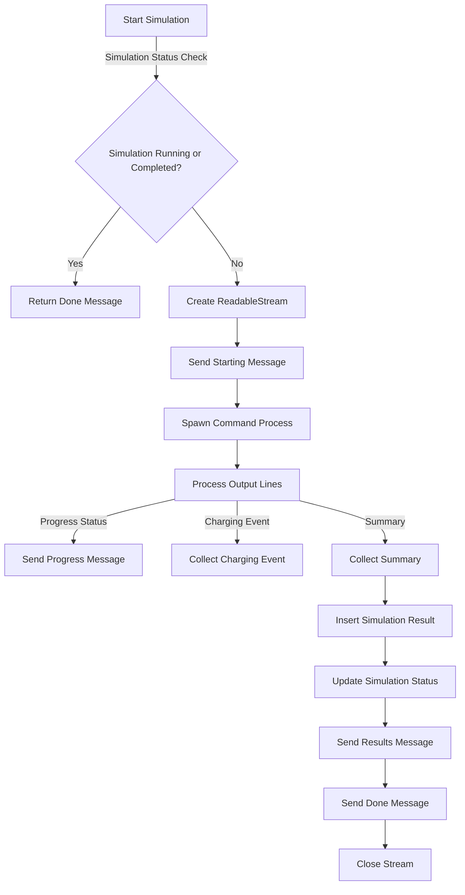

As a shop owner, you want to install EV chargers in your parking lot. To avoid costly upgrades, you need to simulate the actual power requirements and energy consumption of the chargers, rather than relying on the theoretical maximum demand. This will help you make informed decisions and optimize your setup.

## Background job workflow

